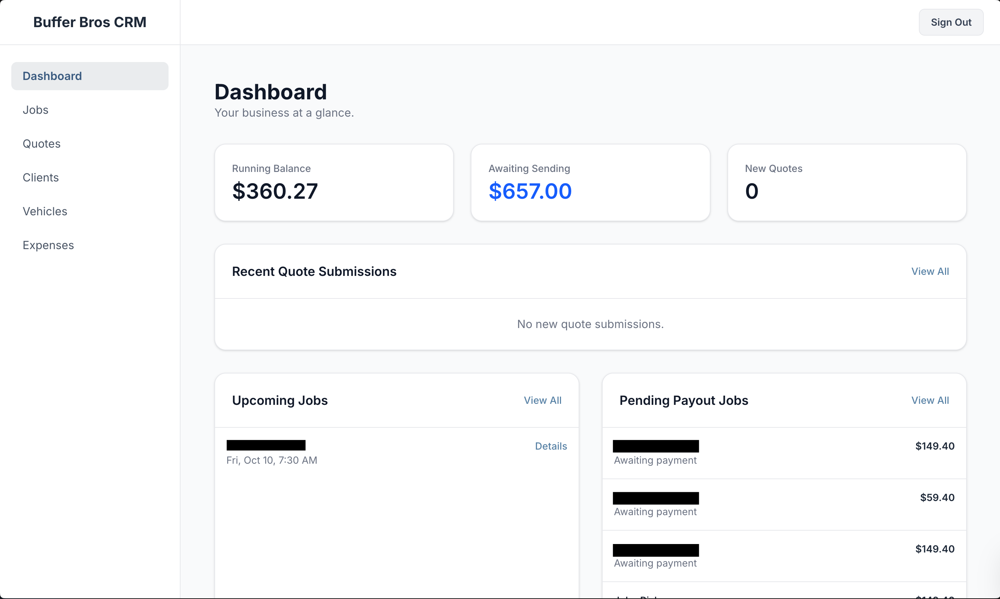

# Buffer Bros CRM - Internal Detailing Business Management



Buffer Bros CRM is a full-stack web application built to serve as the internal management hub for a fictional auto detailing business, "Buffer Bros Auto Detailing". This custom-built Customer Relationship Management (CRM) system streamlines operations, from initial client quotes to job scheduling and financial tracking, providing a single source of truth for the business.

This project was developed as a comprehensive portfolio piece to demonstrate skills in modern full-stack web development, database design, and third-party API integration.

**Live Site:** crm.bufferbros.org/dashboard

---

## ✨ Core Features

*   **📊 Interactive Dashboard:** A central hub providing an at-a-glance overview of the business, including:
    *   Key financial metrics like running balance and pending payouts.
    *   Actionable stats such as new quotes and upcoming jobs.
    *   Lists of recent quotes, upcoming jobs, and completed jobs awaiting payment.
    *   A monthly performance chart visualizing business share vs. expenses over time.

*   **🗂️ Job Management:** A complete workflow for managing detailing jobs.
    *   Create new jobs with detailed information, linking clients, vehicles, services, and add-ons.
    *   Calculate total job price automatically based on selected services and add-ons, with support for custom pricing.
    *   Track job status from `new` to `scheduled`, `completed`, and `paid`.

*   **🚗 Vehicle & Client Database:**
    *   Maintain a comprehensive database of all client vehicles.
    *   Advanced table functionality with debounced search, multi-column sorting, and pagination to efficiently handle large datasets.

*   **📄 Quote & Expense Tracking:**
    *   Log and manage incoming client quote submissions.
    *   Track business expenses to maintain an accurate running balance.

*   **🔐 Authentication:** Secure user authentication to protect business data.

*   **🔄 Google Sheets Integration:** Automatically syncs new scheduled jobs to a Google Sheet via a custom API route, providing a reliable external backup and enabling further data analysis.

---

## 🛠️ Tech Stack & Architecture

This project is built with a modern, robust, and scalable technology stack.

| Category          | Technology                                                                                             |
| ----------------- | ------------------------------------------------------------------------------------------------------ |
| **Framework**     | **Next.js 14** (App Router)                                                       |
| **Language**      | **TypeScript**                                                      |
| **Backend/DB**    | **Supabase** (PostgreSQL, Auth, Storage, RPC Functions)                         |
| **Styling**       | **Tailwind CSS**                                                             |
| **UI Components** | Custom-built with React; `recharts` for data visualization                                             |
| **State Mgmt**    | React Hooks (`useState`, `useEffect`, `useCallback`, `useMemo`)                                        |
| **Integrations**  | Google Sheets API                                                                                        |
| **Deployment**    | **Vercel**                                                                        |

### Architectural Highlights

*   **Client-Side Rendering (CSR):** The application primarily uses a CSR approach with the `'use client'` directive in Next.js. This is ideal for a highly interactive, data-driven dashboard where content is dynamic and user-specific.

*   **Efficient Data Fetching:**
    *   Concurrent data fetching on the dashboard using `Promise.all` to minimize load times.
    *   Server-side logic is handled by the Supabase JS client, which communicates directly with the PostgreSQL database.
    *   Implemented advanced Supabase features, including Remote Procedure Calls (`rpc`) for optimized search functionality and `count: 'exact'` for efficient pagination without fetching all data.

*   **Debounced Search:** The search functionality on the vehicles page uses a debouncing mechanism with a 500ms delay. This prevents excessive API calls while the user is typing, improving performance and user experience.

*   **Custom API Route:** A Next.js API route (`/api/jobs/add-to-sheet`) was created to handle the integration with Google Sheets. This abstracts the third-party logic from the frontend and provides a secure, server-side endpoint to perform the action.

---

## 🚀 Getting Started

To get a local copy up and running, follow these simple steps.

### Prerequisites

*   Node.js (v18.x or later)
*   npm, yarn, or pnpm
*   A Supabase account and project

### Installation

1.  **Clone the repository:**
    ```sh
    git clone https://github.com/tymastrangelo/bufferbros-crm.git
    cd bufferbros-crm
    ```

2.  **Install dependencies:**
    ```sh
    npm install
    ```

3.  **Set up environment variables:**
    *   Create a `.env.local` file in the root of the project.
    *   Add your Supabase project URL and Anon Key:
        ```env
        NEXT_PUBLIC_SUPABASE_URL=https://your-project-id.supabase.co
        NEXT_PUBLIC_SUPABASE_ANON_KEY=your-anon-key
        ```

4.  **Set up the Supabase database:**
    *   Use the SQL schema located in `schema-file.txt` to set up your database tables. For better editor support and convention, you may want to rename this file to `schema.sql`.
    *   Make sure to enable Row Level Security (RLS) on your tables and create policies for secure data access.
    *   The schema provided is for reference; you will need to execute the `CREATE TABLE` statements in the correct order to satisfy foreign key constraints.

5.  **Run the development server:**
    ```sh
    npm run dev
    ```

Open http://localhost:3000 with your browser to see the result.

---

## 💡 Future Improvements

*   **Real-time Updates:** Integrate Supabase Realtime to instantly update the UI when database changes occur (e.g., a new job is added).
*   **User Roles & Permissions:** Expand the auth system to include different user roles (e.g., Admin, Detailer) with varying levels of access.
*   **Component & E2E Testing:** Implement a testing suite using Jest, React Testing Library, and Cypress to ensure application reliability.
*   **Storybook:** Create a Storybook to document and develop UI components in isolation.

---

## 👤 Contact

Tyler Mastrangelo - [linkedin.com/in/tymastrangelo](https://www.linkedin.com/in/tymastrangelo) - mastrangelo.tyler@gmail.com

Project Link: [https://github.com/tymastrangelo/bufferbros-crm](https://github.com/tymastrangelo/bufferbros-crm)